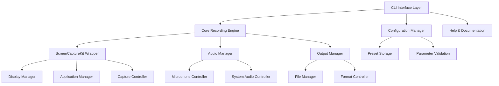

# Design Document

## Overview

This design document outlines the architecture and implementation approach for upgrading the existing SwiftCapture CLI tool into a comprehensive, professional-grade screen recording application. The upgrade will transform the current basic argument parsing into a robust CLI interface using Swift ArgumentParser, implement modular architecture for different recording modes, and add advanced features like multi-screen support, application window recording, and audio control.

The design follows modern Swift best practices, leverages ScreenCaptureKit capabilities, and ensures the tool is suitable for distribution via Homebrew with comprehensive documentation.

## Architecture

### High-Level Architecture



### Module Structure

The application will be organized into the following modules:

1. **CLI Interface Layer**: Handles command-line argument parsing and user interaction
2. **Core Recording Engine**: Manages the recording process and coordinates between components
3. **ScreenCaptureKit Wrapper**: Abstracts ScreenCaptureKit functionality
4. **Configuration Manager**: Handles settings, presets, and parameter validation
5. **Audio Manager**: Controls microphone and system audio recording
6. **Output Manager**: Manages file output, formats, and naming conventions

## Components and Interfaces

### 1. CLI Interface Layer

**Primary Components:**

- `SwiftCaptureCommand`: Main command structure using Swift ArgumentParser
- `CommandLineOptions`: Struct containing all CLI options and flags
- `HelpFormatter`: Custom help text formatting for bilingual support

**Key Interfaces:**

```swift
@main
struct SwiftCaptureCommand: AsyncParsableCommand {
    static let configuration = CommandConfiguration(
        commandName: "scap",
        abstract: "Professional screen recording tool for macOS",
        version: "2.0.0"
    )

    // Duration options
    @Option(name: [.short, .long], help: "Recording duration in milliseconds")
    var duration: Int = 10000

    // Output options
    @Option(name: [.short, .long], help: "Output file path")
    var output: String?

    // Screen/Area options
    @Option(name: [.short, .long], help: "Recording area (x:y:width:height)")
    var area: String?

    @Flag(name: [.customShort("sl"), .customLong("screen-list")], help: "List available screens")
    var screenList: Bool = false

    @Option(name: [.short, .long], help: "Screen index to record")
    var screen: Int = 1

    // Application options
    @Flag(name: [.customShort("al"), .customLong("app-list")], help: "List running applications")
    var appList: Bool = false

    @Option(name: [.customShort("ap"), .long], help: "Application name to record")
    var app: String?

    // Audio options
    @Flag(name: [.short, .long], help: "Enable microphone recording")
    var enableMicrophone: Bool = false

    // Advanced options
    @Option(help: "Frame rate (15, 30, 60)")
    var fps: Int = 30

    @Option(help: "Quality preset (low, medium, high)")
    var quality: String = "medium"

    @Option(help: "Output format (mov, mp4)")
    var format: String = "mov"

    @Flag(help: "Show cursor in recording")
    var showCursor: Bool = false

    @Option(help: "Countdown before recording starts")
    var countdown: Int = 0

    // Preset options
    @Option(help: "Save current settings as preset")
    var savePreset: String?

    @Option(help: "Load settings from preset")
    var preset: String?

    @Flag(help: "List saved presets")
    var listPresets: Bool = false

    @Option(help: "Delete preset")
    var deletePreset: String?

    func run() async throws {
        let recorder = SwiftCapture()
        try await recorder.execute(with: self)
    }
}
```

### 2. Core Recording Engine

**Primary Components:**

- `SwiftCapture`: Main coordinator class
- `RecordingSession`: Manages individual recording sessions
- `RecordingConfiguration`: Immutable configuration object

**Key Interfaces:**

```swift
class SwiftCapture {
    private let displayManager: DisplayManager
    private let applicationManager: ApplicationManager
    private let audioManager: AudioManager
    private let outputManager: OutputManager
    private let configManager: ConfigurationManager

    func execute(with options: SwiftCaptureCommand) async throws {
        // Handle list operations first
        if options.screenList { return try displayManager.listScreens() }
        if options.appList { return try applicationManager.listApplications() }
        if options.listPresets { return try configManager.listPresets() }

        // Handle preset operations
        if let presetName = options.deletePreset {
            return try configManager.deletePreset(named: presetName)
        }

        // Create recording configuration
        let config = try createConfiguration(from: options)

        // Save preset if requested
        if let presetName = options.savePreset {
            try configManager.savePreset(named: presetName, config: config)
        }

        // Execute recording
        try await performRecording(with: config)
    }

    private func createConfiguration(from options: SwiftCaptureCommand) throws -> RecordingConfiguration
    private func performRecording(with config: RecordingConfiguration) async throws
}

struct RecordingConfiguration {
    let duration: TimeInterval
    let outputURL: URL
    let recordingArea: RecordingArea
    let targetScreen: ScreenInfo?
    let targetApplication: ApplicationInfo?
    let audioSettings: AudioSettings
    let videoSettings: VideoSettings
    let showCursor: Bool
    let countdown: Int
}
```

### 3. ScreenCaptureKit Wrapper

**Primary Components:**

- `DisplayManager`: Manages screen detection and selection
- `ApplicationManager`: Handles application window detection
- `CaptureController`: Controls the actual recording process

**Key Interfaces:**

```swift
class DisplayManager {
    func listScreens() throws {
        // List all available screens with index, resolution, and name
    }

    func getScreen(at index: Int) throws -> ScreenInfo {
        // Get specific screen information
    }

    func getAllScreens() async throws -> [ScreenInfo] {
        // Get all available screens
    }
}

class ApplicationManager {
    func listApplications() throws {
        // List all running applications
    }

    func getApplication(named name: String) throws -> ApplicationInfo {
        // Find application by name
    }

    func getAllApplications() async throws -> [ApplicationInfo] {
        // Get all running applications
    }
}

class CaptureController {
    func startCapture(with config: RecordingConfiguration) async throws -> SCStream
    func stopCapture(_ stream: SCStream) async throws
    func createStreamConfiguration(from config: RecordingConfiguration) -> SCStreamConfiguration
}
```

### 4. Configuration Manager

**Primary Components:**

- `ConfigurationManager`: Handles presets and validation
- `PresetStorage`: Manages preset persistence
- `ParameterValidator`: Validates user input

**Key Interfaces:**

```swift
class ConfigurationManager {
    private let presetStorage: PresetStorage
    private let validator: ParameterValidator

    func savePreset(named name: String, config: RecordingConfiguration) throws
    func loadPreset(named name: String) throws -> RecordingConfiguration
    func listPresets() throws
    func deletePreset(named name: String) throws
    func validateConfiguration(_ config: RecordingConfiguration) throws
}

class ParameterValidator {
    func validateDuration(_ duration: Int) throws
    func validateArea(_ area: String) throws -> RecordingArea
    func validateScreen(_ screenIndex: Int) throws
    func validateApplication(_ appName: String) throws
    func validateOutputPath(_ path: String?) throws -> URL
}
```

### 5. Audio Manager

**Primary Components:**

- `AudioManager`: Coordinates audio recording
- `MicrophoneController`: Manages microphone input
- `SystemAudioController`: Handles system audio capture

**Key Interfaces:**

```swift
class AudioManager {
    func configureAudio(for config: RecordingConfiguration) throws -> AudioSettings
    func setupMicrophone() throws -> AVAudioEngine?
    func validateAudioDevices() throws
}

struct AudioSettings {
    let includeMicrophone: Bool
    let includeSystemAudio: Bool
    let quality: AudioQuality
    let sampleRate: Double
    let bitRate: Int
}
```

### 6. Output Manager

**Primary Components:**

- `OutputManager`: Manages file output
- `FileManager`: Handles file operations
- `FormatController`: Manages different output formats

**Key Interfaces:**

```swift
class OutputManager {
    func generateOutputURL(from path: String?) -> URL
    func validateOutputPath(_ url: URL) throws
    func createWriter(for url: URL, format: OutputFormat) throws -> AVAssetWriter
    func configureVideoSettings(for config: RecordingConfiguration) -> [String: Any]
    func configureAudioSettings(for config: RecordingConfiguration) -> [String: Any]
}

enum OutputFormat: String, CaseIterable {
    case mov = "mov"
    case mp4 = "mp4"

    var fileType: AVFileType {
        switch self {
        case .mov: return .mov
        case .mp4: return .mp4
        }
    }
}
```

## Data Models

### Core Data Structures

```swift
struct ScreenInfo {
    let index: Int
    let displayID: CGDirectDisplayID
    let frame: CGRect
    let name: String
    let isPrimary: Bool
    let scaleFactor: CGFloat
}

struct ApplicationInfo {
    let bundleIdentifier: String
    let name: String
    let processID: pid_t
    let windows: [WindowInfo]
    let isRunning: Bool
}

struct WindowInfo {
    let windowID: CGWindowID
    let title: String
    let frame: CGRect
    let isOnScreen: Bool
}

enum RecordingArea {
    case fullScreen
    case customRect(CGRect)
    case centered(width: Int, height: Int)

    func toCGRect(for screen: ScreenInfo) -> CGRect {
        switch self {
        case .fullScreen:
            return screen.frame
        case .customRect(let rect):
            return rect
        case .centered(let width, let height):
            let x = (screen.frame.width - CGFloat(width)) / 2
            let y = (screen.frame.height - CGFloat(height)) / 2
            return CGRect(x: x, y: y, width: CGFloat(width), height: CGFloat(height))
        }
    }
}

struct VideoSettings {
    let fps: Int
    let quality: VideoQuality
    let codec: AVVideoCodecType
    let showCursor: Bool
    let resolution: CGSize
}

enum VideoQuality {
    case low, medium, high

    var bitRateMultiplier: Int {
        switch self {
        case .low: return 1
        case .medium: return 2
        case .high: return 4
        }
    }
}
```

### Preset Data Model

```swift
struct RecordingPreset: Codable {
    let name: String
    let duration: Int
    let area: String?
    let screen: Int
    let app: String?
    let enableMicrophone: Bool
    let fps: Int
    let quality: String
    let format: String
    let showCursor: Bool
    let countdown: Int
    let createdAt: Date
    let lastUsed: Date?
}
```

## Error Handling

### Error Types

```swift
enum SwiftCaptureError: LocalizedError {
    case invalidDuration(Int)
    case invalidArea(String)
    case screenNotFound(Int)
    case applicationNotFound(String)
    case invalidOutputPath(String)
    case recordingFailed(Error)
    case audioSetupFailed(Error)
    case presetNotFound(String)
    case presetAlreadyExists(String)
    case systemRequirementsNotMet

    var errorDescription: String? {
        switch self {
        case .invalidDuration(let duration):
            return "Invalid duration: \(duration)ms. Duration must be at least 100ms."
        case .invalidArea(let area):
            return "Invalid area format: '\(area)'. Expected format: x:y:width:height"
        case .screenNotFound(let index):
            return "Screen \(index) not found. Use --screen-list to see available screens."
        case .applicationNotFound(let name):
            return "Application '\(name)' not found. Use --app-list to see running applications."
        case .invalidOutputPath(let path):
            return "Invalid output path: '\(path)'. Check directory permissions."
        case .recordingFailed(let error):
            return "Recording failed: \(error.localizedDescription)"
        case .audioSetupFailed(let error):
            return "Audio setup failed: \(error.localizedDescription)"
        case .presetNotFound(let name):
            return "Preset '\(name)' not found. Use --list-presets to see available presets."
        case .presetAlreadyExists(let name):
            return "Preset '\(name)' already exists. Use a different name or delete the existing preset."
        case .systemRequirementsNotMet:
            return "System requirements not met. macOS 12.3+ required for ScreenCaptureKit."
        }
    }
}
```

### Error Handling Strategy

1. **Graceful Degradation**: When non-critical features fail, continue with reduced functionality
2. **Clear Error Messages**: Provide actionable error messages with suggestions
3. **Validation Early**: Validate all parameters before starting recording
4. **Resource Cleanup**: Ensure proper cleanup of resources on errors
5. **Logging**: Comprehensive logging for debugging purposes

## Testing Strategy

### Unit Testing

1. **Parameter Validation Tests**

   - Test all CLI argument combinations
   - Validate error cases for invalid inputs
   - Test preset save/load functionality

2. **Configuration Tests**

   - Test configuration creation from CLI options
   - Test preset serialization/deserialization
   - Test parameter validation logic

3. **Manager Tests**
   - Mock ScreenCaptureKit for display/app detection
   - Test audio configuration logic
   - Test output file generation

### Integration Testing

1. **End-to-End Recording Tests**

   - Test basic screen recording functionality
   - Test multi-screen recording
   - Test application window recording
   - Test audio recording with microphone

2. **CLI Interface Tests**

   - Test help text generation
   - Test argument parsing edge cases
   - Test error message formatting

3. **File Output Tests**
   - Test different output formats
   - Test file naming conventions
   - Test directory creation

### Performance Testing

1. **Recording Performance**

   - Test high-resolution recording performance
   - Test long-duration recording stability
   - Test memory usage during recording

2. **Startup Performance**
   - Test CLI argument parsing speed
   - Test screen/app detection performance

### Compatibility Testing

1. **macOS Version Compatibility**

   - Test on macOS 12.3+ (minimum requirement)
   - Test on different macOS versions

2. **Hardware Compatibility**
   - Test on different Mac models
   - Test with various display configurations
   - Test with different audio setups

## Implementation Phases

### Phase 1: Core CLI Infrastructure

- Implement Swift ArgumentParser integration
- Create basic command structure and help system
- Implement parameter validation
- Set up project structure and dependencies

### Phase 2: Enhanced Recording Engine

- Refactor existing recording code into modular architecture
- Implement display and application managers
- Add support for custom recording areas
- Implement multi-screen support

### Phase 3: Advanced Features

- Add application window recording
- Implement microphone audio support
- Add preset system
- Implement advanced video/audio settings

### Phase 4: User Experience

- Add progress indicators and countdown
- Implement bilingual help system
- Add comprehensive error handling
- Create detailed documentation

### Phase 5: Distribution

- Prepare Homebrew formula
- Create installation scripts
- Final testing and optimization
- Documentation finalization
