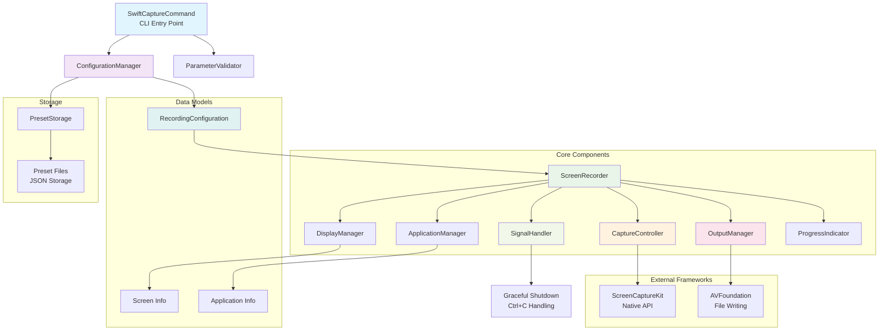

# SwiftCapture Architecture Diagram

This diagram illustrates the main components of SwiftCapture and their relationships:

1. **CLI Layer**: `SwiftCaptureCommand` serves as the entry point, handling all command-line arguments
2. **Configuration Layer**: `ConfigurationManager` and `ParameterValidator` work together to process and validate user input
3. **Core Layer**: `ScreenRecorder` coordinates the recording process, delegating to specialized components
4. **Specialized Managers**: Handle specific aspects like display, applications, audio, and output
5. **Native Integration**: Direct integration with ScreenCaptureKit and AVFoundation
6. **Data Models**: Structured data representations used throughout the application
7. **Storage**: Preset persistence using JSON files