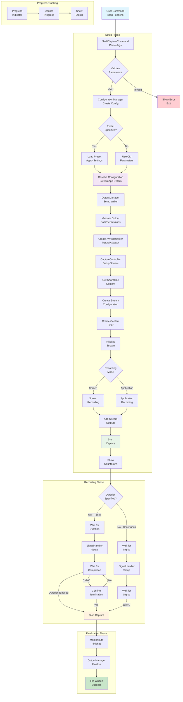

# SwiftCapture Recording Process Flow

## Detailed Process Explanation

### 1. Command Parsing and Validation
- The user executes a command with various options
- `SwiftCaptureCommand` parses all arguments using Swift ArgumentParser
- `ParameterValidator` validates each parameter for correctness

### 2. Configuration Creation
- `ConfigurationManager` creates a `RecordingConfiguration` object
- If a preset is specified, it's loaded and applied to the configuration
- Screen and application details are resolved

### 3. Output Setup
- `OutputManager` prepares the AVAssetWriter for file output
- Output path is validated and conflicts are resolved
- Video and audio inputs are created with appropriate settings

### 4. Capture Initialization
- `CaptureController` retrieves shareable content using ScreenCaptureKit
- Stream configuration is created based on recording settings
- Content filter is set up for screen or application recording

### 5. Recording Execution
- The capture stream is started
- Countdown is displayed if specified
- Recording proceeds in either timed or continuous mode

### 6. Signal Handling
- `SignalHandler` manages Ctrl+C interruptions
- For timed recordings, user confirmation is required for early termination
- For continuous recordings, graceful shutdown is initiated immediately

### 7. Finalization
- Capture stream is stopped
- Inputs are marked as finished
- `OutputManager` finalizes the file writing process
- Progress indicator is stopped and final status is displayed

This flow ensures a robust recording process with proper error handling, user feedback, and graceful shutdown capabilities.